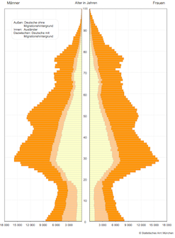

```{r setup, echo=FALSE}
library('ggplot2')
library('knitr')
opts_chunk$set(echo = FALSE, warning = FALSE)
```

## 


## 


## {.emphasizedabit .flexbox .vcenter}

Der Maximum Bauchgefühl Schätzer

# Wir brauchen Versuchspersonen


# Test 1: Punkteschätzer. Wie viele Prozent der Symbole sind rote Dreiecke?


```{r}
set.seed(42)
simulate.points = function(n, p){
  data.frame(
    x = runif(n),
    y = runif(n),
    color = factor(sample(c(0,1), size = n, replace=TRUE, prob = c(1-p, p))))
}
plot.points = function(points, size = 5, random.size = FALSE, flip = FALSE){
  
  if(random.size){
    size = rpois(nrow(points), 7)
  } 
  points$size = size
  
  colors = c('blue', 'red')
  if(flip) colors = rev(colors)
  
  p = ggplot(points) + 
    geom_point(aes(x=x, y=y, color = color, shape= color, size = size)) + 
    theme_void() + 
    scale_color_manual(guide = 'none', values = colors) + 
    scale_shape_discrete(guide = 'none') + 
    scale_size_identity(guide='none')
  return(p)
}
# simulate 
points = simulate.points(20, 0.1)
```


## Beispiel
```{r}
# simulate 
plot.points(points)
```

## {.emphasized .flexbox .vcenter}
Die Zeit ist um!

## Antwort:  `r sprintf("%.0f%s", 100 * mean(points$color == 1), '%') `
```{r}
plot.points(points)
```

## Runde 1

```{r}
points = simulate.points(100, 0.01) 
plot.points(points)
```

## {.emphasized .flexbox .vcenter}
Die Zeit ist um!

## Antwort:  `r sprintf("%.0f%s", 100 * mean(points$color == 1), '%') `
```{r}
plot.points(points)
```


## Runde 2
```{r}
points = simulate.points(200, 0.42)
plot.points(points)
```

## {.emphasized .flexbox .vcenter}
Die Zeit ist um!

## Antwort:  `r sprintf("%.0f%s", 100 * mean(points$color == 1), '%') `
```{r}
plot.points(points)
```

## Runde 3
```{r}
points = simulate.points(1000, 0.94)
plot.points(points)
```

## {.emphasized .flexbox .vcenter}
Die Zeit ist um!

## Antwort:  `r sprintf("%.0f%s", 100 * mean(points$color == 1), '%') `
```{r}
plot.points(points)
```


## Runde 4
```{r}
points = simulate.points(1000, 0.67)
plot.points(points)
```

## {.emphasized .flexbox .vcenter}
Die Zeit ist um!

## Antwort:  `r sprintf("%.0f%s", 100 * mean(points$color == 1), '%') `
```{r}
plot.points(points)
```


## Runde 5
```{r}
points = simulate.points(50, 0.1)
p = plot.points(points,random.size = TRUE)
p
```

## {.emphasized .flexbox .vcenter}
Die Zeit ist um!

## Antwort:  `r sprintf("%.0f%s", 100 * mean(points$color == 1), '%') `
```{r}
p
```


## Runde 6
```{r}
points = simulate.points(50, 0.77)
p = plot.points(points,random.size = TRUE, flip = TRUE)
p
```

## {.emphasized .flexbox .vcenter}
Die Zeit ist um!

## Antwort: 0%
```{r}
p
```


# Test 2: Malen nach Tönen

## Beispiel
```{r}
supp = seq(-4, 4, length.out = 100)
st.norm.dens = dnorm(supp)
plot(supp,st.norm.dens, col = "black", xaxt = "n", yaxt = "n", xlab = "Zeit", ylab = "Tonhöhe",
    bty = "l", mgp=c(1,1,0), lwd = 2, type = "l")
```
<audio controls>
  <source src="density_as_sound/st_norm_dens.wav" type="audio/wav">
Your browser does not support the audio element.
</audio>


## Task 1

```{r}
plot(c(1,10),c(-25,2), col = "white", xaxt = "n", yaxt = "n", xlab = "Zeit", ylab = "Tonhöhe",
    bty = "l", mgp=c(1,1,0))
```
<audio controls>
  <source src="density_as_sound/gamma_dens.wav" type="audio/wav">
Your browser does not support the audio element.
</audio>

## Task 1

```{r}
supp = seq(0, 8, length.out = 100)
gamma.dens = dgamma(supp, 2, 1)
plot(supp,gamma.dens, col = "black", xaxt = "n", yaxt = "n", xlab = "Zeit", ylab = "Tonhöhe",
    bty = "l", mgp=c(1,1,0), lwd = 2, type = "l")
```
<audio controls>
  <source src="density_as_sound/gamma_dens.wav" type="audio/wav">
Your browser does not support the audio element.
</audio>

## Task 2

```{r}
plot(c(1,10),c(-25,2), col = "white", xaxt = "n", yaxt = "n", xlab = "Zeit", ylab = "Tonhöhe",
    bty = "l", mgp=c(1,1,0))

```
<audio controls>
  <source src="density_as_sound/ex.wav" type="audio/wav">
Your browser does not support the audio element.
</audio>

## Task 2
```{r}
supp = seq(1,7, length.out = 100)

ex = ((seq(1, 7, length.out = 100)^1.25*sin(seq(1, 7, length.out = 100)*1.5) -
  (seq(1,7,length.out = 100)-1)^1.05*2) * .03 + .72)*.5

plot(supp, ex, xaxt = "n", yaxt = "n", xlab = "Zeit", ylab = "Tonhöhe",
    bty = "l", mgp=c(1,1,0), type = "l", lwd = 2, xlim = c(1,7), ylim = c(0,.4))

```
<audio controls>
  <source src="density_as_sound/ex.wav" type="audio/wav">
Your browser does not support the audio element.
</audio>


## Task 3

```{r}
plot(c(1,10),c(-25,2), col = "white", xaxt = "n", yaxt = "n", xlab = "Zeit", ylab = "Tonhöhe",
    bty = "l", mgp=c(1,1,0))
```
<audio controls>
  <source src="density_as_sound/step_const.wav" type="audio/wav">
Your browser does not support the audio element.
</audio>

## Task 3

```{r}
supp = seq(0.1, 8, length.out = 100)
step.const = function(x) {
  if(x>0 & x <= 2) {
    1
  } else if( x >2 & x <= 4) {
    2 
  } else if(x>4 & x  <= 6) {
    3
  } else {
    1.75
  }
}

step.const = sapply(supp, step.const)

ind <- which(supp <= 2)
plot(supp[ind], step.const[ind], col = "black", xaxt = "n", yaxt = "n", 
     xlab = "Zeit", ylab = "Tonhöhe",
    bty = "l", mgp=c(1,1,0), lwd = 2, type = "l", xlim = c(0,8), ylim = c(0, 4))
ind <- which(supp>2 & supp <= 4)
points(supp[ind], step.const[ind], col = "black", lwd = 2, type = "l")
ind <- which(supp>4 & supp <= 6)
points(supp[ind], step.const[ind], col = "black", lwd = 2, type = "l")
ind <- which(supp>6 & supp <= 8)
points(supp[ind], step.const[ind], col = "black", lwd = 2, type = "l")
```
<audio controls>
  <source src="density_as_sound/step_const.wav" type="audio/wav">
Your browser does not support the audio element.
</audio>


## Task 4

```{r}
plot(c(1,10),c(-25,2), col = "white", xaxt = "n", yaxt = "n", xlab = "Zeit", ylab = "Tonhöhe",
    bty = "l", mgp=c(1,1,0))
```
<audio controls>
  <source src="density_as_sound/sine.wav" type="audio/wav">
Your browser does not support the audio element.
</audio>

## Task 4

```{r}
supp = seq(0,2*pi, length.out = 200)

sine.fun =  sin(4*supp)

plot(supp, sine.fun, col = "black", xaxt = "n", yaxt = "n", xlab = "Zeit", 
     ylab = "Tonhöhe", bty = "l", mgp=c(1,1,0), lwd = 2, type = "l", xlim = c(0,2*pi))
```
<audio controls>
  <source src="density_as_sound/sine.wav" type="audio/wav">
Your browser does not support the audio element.
</audio>

## Task 5

```{r}
plot(c(1,10),c(-25,2), col = "white", xaxt = "n", yaxt = "n", xlab = "Zeit", ylab = "Tonhöhe",
    bty = "l", mgp=c(1,1,0))
```
<audio controls>
  <source src="density_as_sound/lmu.wav" type="audio/wav">
Your browser does not support the audio element.
</audio>

## Task 5

```{r}
lmu.func <- function(x) {
  if (x>=0 & x <= .25) {
    1-4*x
  } else if (x>.25 & x <= 1.25) {
    0
  } else if (x>1.25 & x <=1.75) {
    2*(x-1.25)
  } else if (x>1.75 & x <= 2.25) {
    1-2*(x-1.75)
  } else if (x>2.25 & x <= 2.75) {
    2*(x-2.25)
  } else if (x>2.75 & x <= 3.25) {
    1-2*(x-2.75)
  } else {
    (x - 4)^2 / .5625
  }
}

supp = seq(0, 4.75, length.out = 500)

lmu = sapply(supp, lmu.func)

ind <- which(supp <= 3.25)
plot(supp[ind], lmu[ind], col = "black", xaxt = "n", yaxt = "n", xlab = "Zeit", ylab = "Tonhöhe",
    bty = "l", mgp=c(1,1,0), lwd = 2, type = "l", xlim = c(0,4.75))
points(supp[-ind], lmu[-ind], col = "black", lwd = 2, type = "l")
```
<audio controls>
  <source src="density_as_sound/lmu.wav" type="audio/wav">
Your browser does not support the audio element.
</audio>

# Test 3: WiSo München
## Frage 1 {.flexbox .vcenter}

Wie viele Einwohner hat München zum Stichtag 31.12.2016?


## Frage 1 {.flexbox .vcenter}

<font size="26">1.542.860</font>

## Frage 2 {.flexbox .vcenter}

Wie viele MünchnerInnen waren Ende 2016 älter als 100 Jahre?



## Frage 2 {.flexbox .vcenter}

<font size="26">367</font>

## Frage 3 {.flexbox .vcenter}

Welches ist der flächenmäßig größte Stadtteil Münchens?


## Frage 3 {.flexbox .vcenter}

<font size="26">Aubing - Lochhausen - Langwied </font>


## Frage 4 {.flexbox .vcenter}

Auf wieviele Einwohner kommt ein Hund?


## Frage 4 {.flexbox .vcenter}

<font size="26"> 44 </font>

# Test 4: Maximum Schätzer

## Finde das Maximum 

Wir ziehen 5 Zahlen zwischen 0 und einem unbekanntem Höchstwert.

Aufgabe: Versucht herauszufinden was der unbekannte Höchstwert ist.

```{r}
set.seed(42)
get.max.game.numbers = function(maxim, min=0, n=5, sort.numbers=FALSE){
   numbers = sample(min:maxim, size=n, replace=FALSE)
   if(sort.numbers){
     numbers = sort(numbers)
   }
   numbers
}
maxim = 10
numbers =get.max.game.numbers(maxim)
```


## Beispiel 

# `r numbers[1]`
# `r numbers[2]`
# `r numbers[3]`
# `r numbers[4]`
# `r numbers[5]`

## {.emphasized .flexbox .vcenter}
Die Zeit ist um!

## Antwort: `r maxim`

`r paste(numbers, collapse=', ')`


## Runde 1
```{r}
maxim = 15 
numbers = get.max.game.numbers(maxim)
```

# `r numbers[1]`
# `r numbers[2]`
# `r numbers[3]`
# `r numbers[4]`
# `r numbers[5]`

## {.emphasized .flexbox .vcenter}
Die Zeit ist um!

## Antwort: `r maxim` bzw. die Anzahl an Sektflaschen für die Weihnachtsfeier

`r paste(numbers, collapse=', ')`


## Runde 2

```{r}
maxim = 60 
numbers = get.max.game.numbers(maxim)
```


# `r numbers[1]`
# `r numbers[2]`
# `r numbers[3]`
# `r numbers[4]`
# `r numbers[5]`


## {.emphasized .flexbox .vcenter}
Die Zeit ist um!

## Antwort: `r maxim` bzw. die Anzahl an Brezn für die Feier

`r paste(numbers, collapse=', ')`


## Runde 3

```{r}
maxim = 33
numbers =get.max.game.numbers(maxim)
```

# `r numbers[1]`
# `r numbers[2]`
# `r numbers[3]`
# `r numbers[4]`
# `r numbers[5]`

## {.emphasized .flexbox .vcenter}
Die Zeit ist um!

## Antwort: `r maxim` bzw. die Hausnummer des Instituts

`r paste(numbers, collapse=', ')`


## Runde 4

```{r}
maxim = 5000000L
numbers =get.max.game.numbers(maxim)
```

# `r numbers[1]`
# `r numbers[2]`
# `r numbers[3]`
# `r numbers[4]`
# `r numbers[5]`

## {.emphasized .flexbox .vcenter}
Die Zeit ist um!

## Antwort: `r maxim` bzw. Leberkäse (in Milligram) heute im Statistik Institut

`r paste(numbers, collapse=', ')`


# Auswertung läuft

##  {.emphasized .flexbox .vcenter}

BILD


